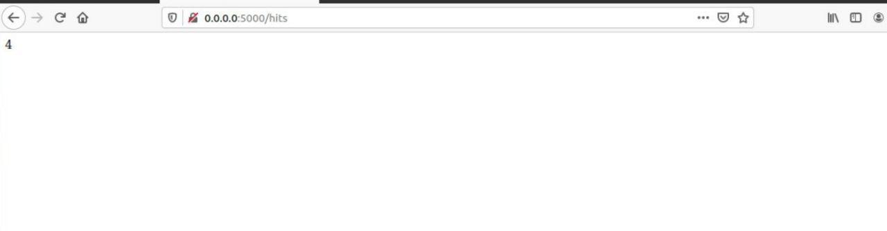
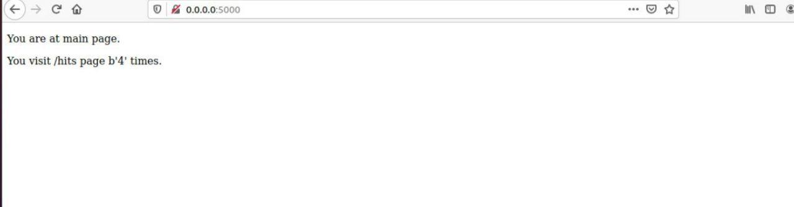
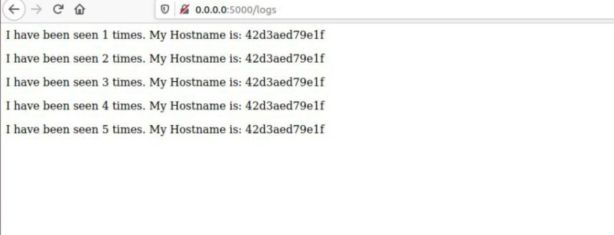

# lab5
## Makefile
---
1. Створила папки:
    - `my_app`
    - `tests`
2. Перевірила проект на працездатність:
   - pipenv --python 3.8
   - pipenv install -r requirements.txt
   - pipenv run python3 app.py
   - pipenv run pytest test_app.py --url http://localhost:5000
   
3. Видалила файли та перевірила роботу сайту:
   - Pipfile
   - Pipfile.lock
   
4. Створила файли:
    - Dockerfile.app
    - Dockerfile.tests 
    - Makefile
5. Ознайомилася з вмістом Dockerfile та Makefile та його директивами:
    - `STATES` - змінні які містить назви тегів
    - `REPO` -  містить назву Docker Hub репозиторію;
    - `.PHONY` - вказує файлу, що переліченні нище цілі не є файлами;
    - `$(STATES)` - ціль, призначення для білду контейнера;
    - `run` - ціль, призначення для створення мережі, у якій буде працювати додаток; запуску додатку і сховища `redis`;
    - `test-app` - запуск контейнера тестової програми;
    - `docker-prune` -очистка ресурсів, що бути використанні при роботі `Docker`.
6. Створила Docker імеджі для додатку та для тестів:
    - make .PHONY
7. Запустила додаток, відкрила новий термінал та запустила тести:
    - make run
    - make test-app
    - тести пройшли успішно:
    - кожна сторінка веб-сайту працює:
      - 
      - 
      - 
   
    
8. Очистила всі ресурси Docker:
    - make docker-prune
9. Створила директиву в `Makefile` для завантаження створених імеджів у Docker Hub репозиторій:
    ```
    push:
	  @docker push $(REPO):app
	  @docker push $(REPO):tests
    ```
    - [lab5](https://hub.docker.com/repository/docker/diano4ka/lab5);

10. Створила директиву `delete-images`:
   ```
   delete-images:
      @docker rmi --force $$(docker images -q)
   ```

## Docker-compose
1. Створила файл `docker-compose.yaml`
2. Запустила `docker-compose`:
    - docker-compose -p lab5 up
3. Веб-сайт працює. 
   - адреса:
     - http://0.0.0.0:5000.

4. Імеджі мають теги `compose-tests`, `compose-app`.
5. Зупинила проект і очистила ресурси:
   - `docker-compose down`
6. Завантажила створені імеджі до `Docker Hub` репозиторію за допомогою команди:
    - docker-compose push
## Захист
1. Docker-compose краще використовувати для багатоконтейнерної структури
2. Створила docker-compose.yaml для lab4:
   - Запустила `docker-compose.yaml`:
        - docker-compose -p lab4 up
   - Веб-сайт працює
   - Зупинила проект і очистила ресурси:
      - docker-compose down
           
   - Завантажила створені імеджі до `Docker Hub`
      - docker-compose push
      - [lab4](https://hub.docker.com/repository/docker/diano4ka/lab4):
